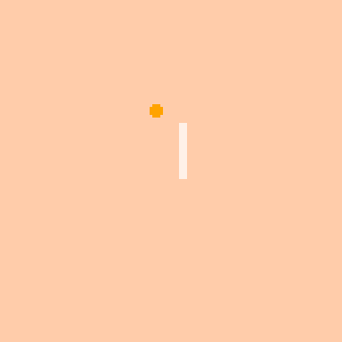

# Picomaki



## Dlaczego nasza gra jest warta uwagi?

W Picomaki warto zagrać ponieważ dzięki tej grze zostaniesz mistrzem japońskiej kuchni. I gier też.

## Mantra

Gotowanie sushi za pomocą dwóch przycisków, noża i kuli piłki kucharskiej. 

## Filary

szybkość, chaos, wyzwanie

## Mechanika

W grze naszym celem jest realizacja zamówień klientów za pomocą  piłki kucharskiej, którą odbijamy nożem kuchennym.  

Nóż przemieszcza się na boki, piłka zaś odbija się od krawędzi ekranu.

Składniki przemieszczają się zgodnie z ruchem wskazówek zegara po ekranie przy krawędzi. 
Po wykonaniu pełnego cyklu po planszy, zmienaiją się w inne składniki. 

Jeżeli gracz trafi niewłaściwy składnik, suma punktów za jego zamówienie się zmniejsza.

## UXUI

### UI:
    * stetowanie nożem za pomocą przycisków ⬅️ i ➡️
    * interfejs zamówień, czasu i składników wyświetlany na środku ekranu
    * ekran na planie kwadratu
    
### User Experience:
    
#### User Persona

```
Filip Retrokiewicz

	* wiek: 18 lat 
	* zawód: uczeń liceum


	* zainteresowania:
	* gry wideo
	* gry planszowe
	* surfowanie internetu
	* anime
	* mangi
	* seriale 
	* programowanie
	* technologia
	* książki SIFI
	* bio:

Filip jest mieszkańcem Warszawy, chociaż pochodzi z Krakowa.
Jest uczniem liceum i jego pasją życiową są  gry.
Lubi grać, a nawet trochę uczy się ich projektowaniaw wolnych chwilach.
Czuje nostalgię do retro, chociaż nigdy nie miał ZX Spectrum.


```

#### User Journey Map

Ekran startowy --> Główna pętla --> Restart / Wyjście


## Styl graficzny

[moodboard](https://pin.it/2z1A40b)

## Muzyka / dzwięk

### Dźwięki jako feedback akcji gracza:
	* Dzwięki odbijania piłki,
	* Dzwięki trafiania w otpowiednie składniki, 
	* Złe składniki
### Dzwięki informujące:
	* Gracz zostaje powiadomiony o nowych zamówieniach
	* Upływający czas na obecne zamówienia

### Muzyka
Muzyka nawiązująca do tradycyjnej muzyki japońskiej, pianino i instrumenty smyczkowe, flet
Muzyka jako tło gameplayu


